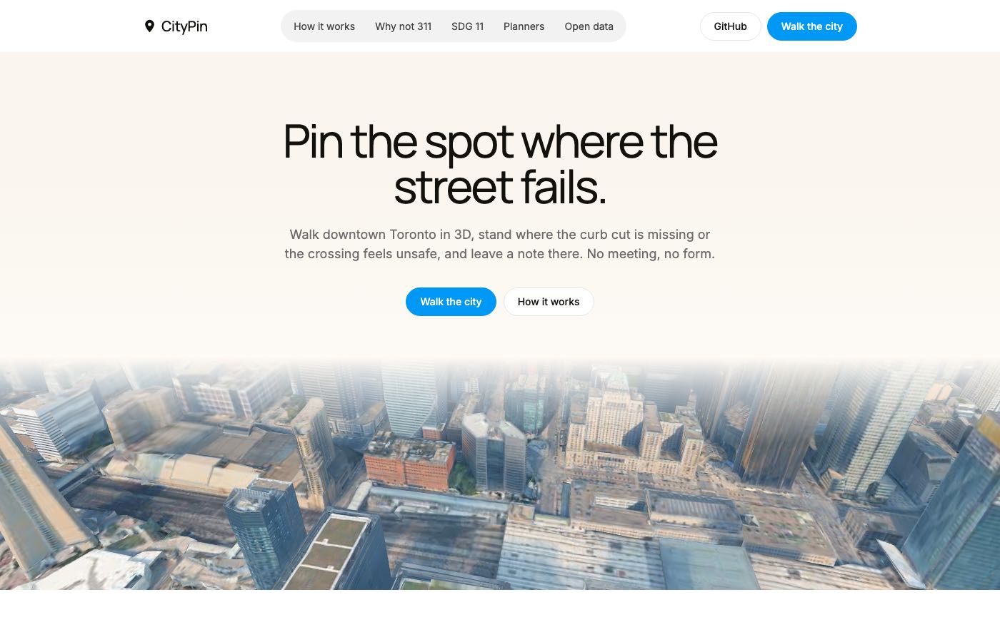
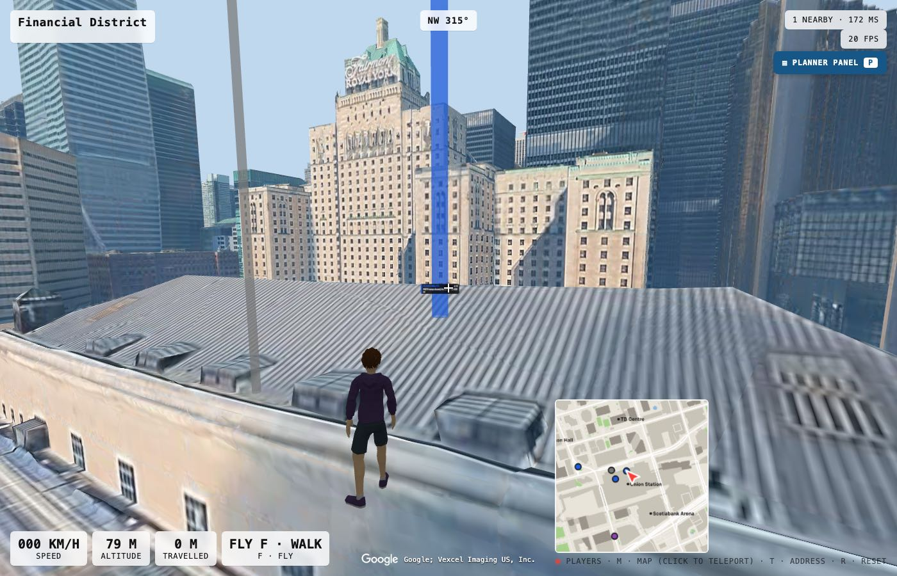
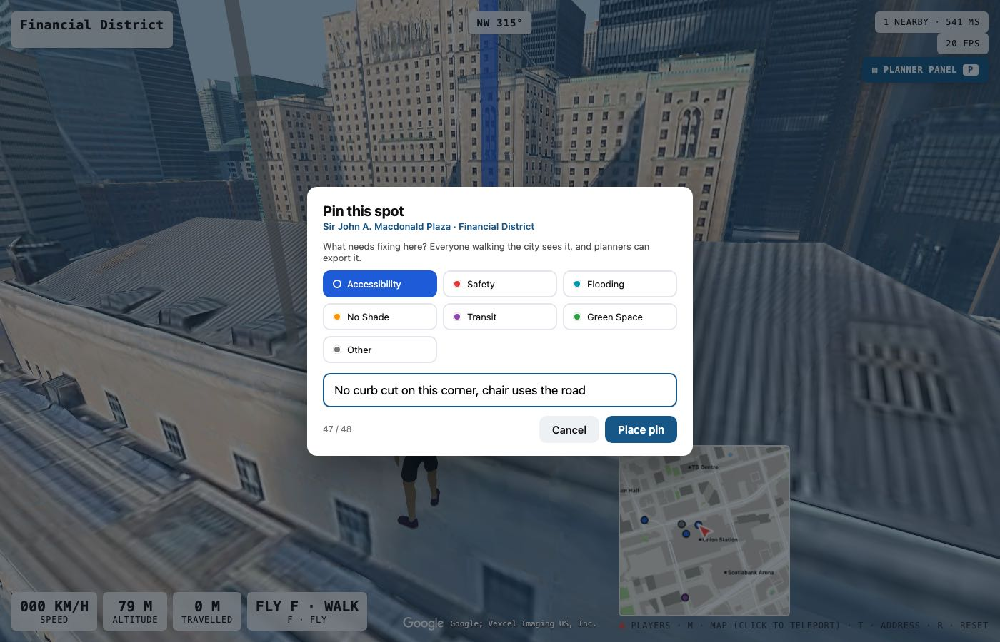
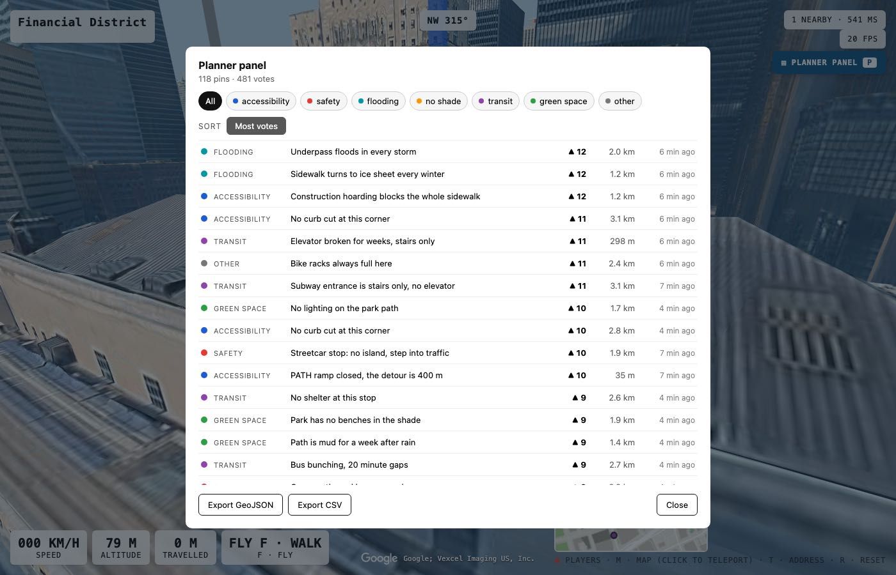
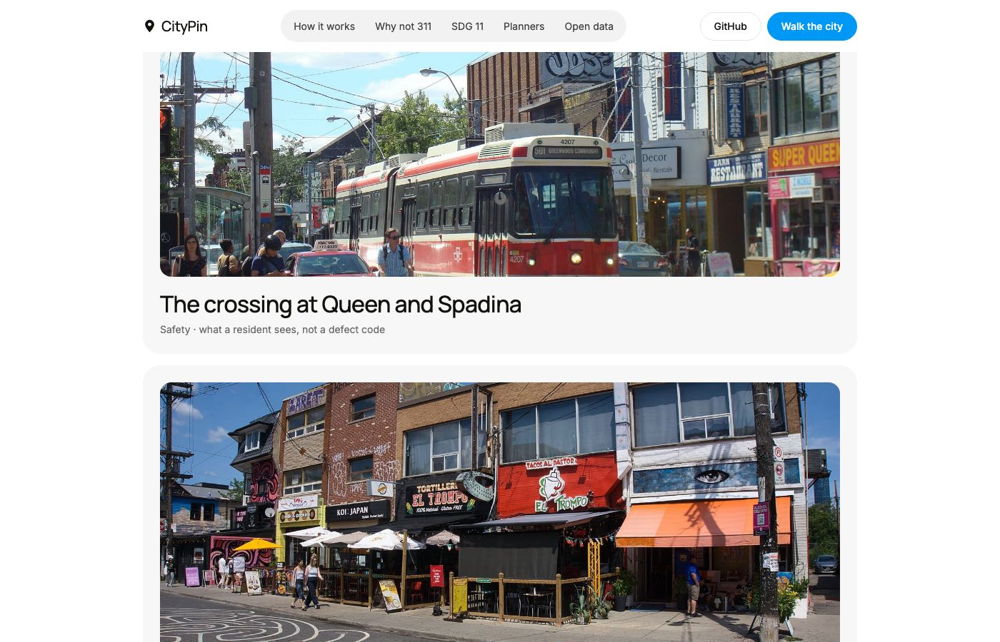
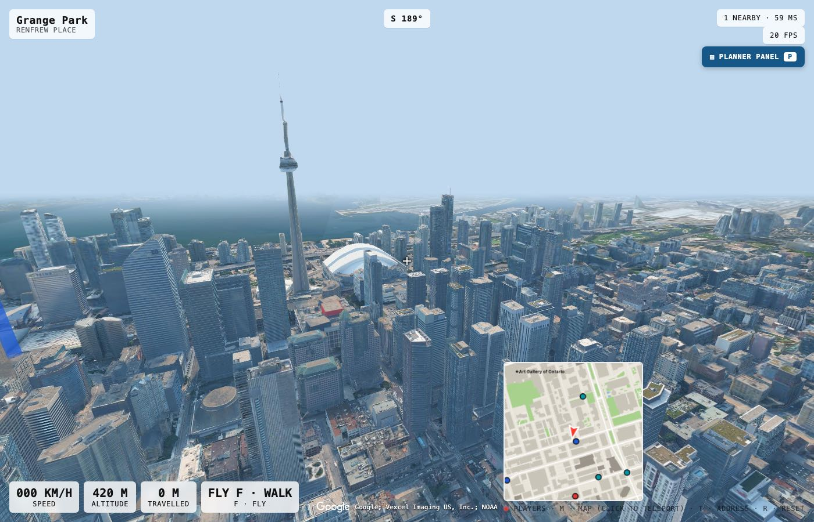

# CityPin

**Walk downtown Toronto in 3D and pin the spot where the street fails.**

Live: **https://citypin.pages.dev** — no account, works on desktop and phone.



CityPin is a civic reporting tool built for a hackathon on UN Sustainable Development Goal 11
(sustainable cities). Residents walk a first-person, photorealistic reconstruction of downtown
Toronto in the browser, stand where a curb cut is missing or a crossing feels unsafe, and leave a
note there. Every pin syncs live to everyone else in the city and survives a server restart.
Planners get a ranked list and a one-click GeoJSON or CSV export that opens in the GIS a city
already runs.

## The problem

The residents most affected by bad street design are the least able to attend the meeting where
it gets decided. Public consultation in practice means a slide deck in a community centre on a
Tuesday evening, which filters out older people, disabled people, shift workers and parents of
young children.

The tools meant to catch the rest don't. A 311 call reports a defect where you are standing, now.
It cannot carry an opinion about a place you are afraid to walk to, or about a bike lane that
doesn't exist yet. A comment form strips out the one thing a planner needs: the exact spot, the
sightline and the scale. CityPin keeps all three.

## How it works



1. **Walk.** First-person movement through downtown Toronto. Google photorealistic 3D tiles by
   default, with an automatic fallback to a free OpenStreetMap city built from 44,000 building
   footprints. Press F to fly, M for the map, T for an address.
2. **Pin.** Aim the crosshair and click. A ground target shows where the pin will land. Pick one
   of seven categories and type a note of up to 48 characters. The dialog names the street and
   neighbourhood you are looking at.
3. **Everyone sees it.** Pins are beacons: a column of light in the category colour that reads
   from kilometres away. A new pin lands with a pulse on every connected screen.
4. **Agree.** Walk past someone else's pin and press U. Votes are deduplicated per browser, so
   one complaint becomes a count.
5. **Hand off.** Press P for the planner panel: every pin with category, note, votes, distance
   and age, filtered by category, sorted by newest or most votes, click to teleport. Export the
   filtered set as GeoJSON (longitude, latitude order) or CSV.





Categories: accessibility barrier, safety, flooding, no shade, transit, green space, other.

Controls: WASD move · mouse look · click to pin · U agree · P planner panel · M map ·
T address · F fly · V camera · R reset. On a phone: d-pad, drag to look, PIN and AGREE buttons.

## Why not just call 311?



311 is for defects: a pothole, a dead streetlight, a blocked drain. CityPin is for design: the
crossing that feels unsafe, the stop with no shade, the underpass people avoid. A pin carries
coordinates, a category and the view the resident had when they left it, and it exports straight
into a GIS or into the 311 queue as a georeferenced request. It complements 311; it does not
replace it.

## SDG alignment

| Target | Text | How CityPin touches it |
| --- | --- | --- |
| **11.3** | Inclusive and sustainable urbanization, participatory planning | Consultation stops selecting for who is free on a Tuesday evening. Residents report from home, standing in the spot. |
| 11.2 | Accessible transport for all, notably older persons and persons with disabilities | Pins mark barriers on the route to transit: missing curb cuts, blocked sidewalks, no seating at the stop. |
| 11.7 | Safe, inclusive, accessible green and public spaces | Dark underpasses, unshaded waits and unusable parks get a location, a category and a count. |

## Architecture



- **Client**: TypeScript, three.js, Vite. Photorealistic tiles via `3d-tiles-renderer` with a
  BVH-accelerated ground raycast; the OSM city is one merged mesh per 400 m tile. Pins are one
  instanced beam mesh plus canvas-sprite labels. Static site on Cloudflare Pages.
- **Relay**: Node, `ws`, a binary little-endian protocol with no allocations on the hot path.
  10 Hz player snapshots by spatial cell; pins broadcast city-wide. Origin allow-list, per-address
  socket cap, token-bucket rate limiting, 64-byte payload cap.
- **Pins on the relay**: validated server-side (within 150 m of the reporter, 5 s cooldown,
  5,000 total, 50 per browser, notes cleaned and capped at 48 UTF-8 bytes), persisted to a JSON
  file every 30 s, on shutdown and on SIGTERM. A newcomer receives every pin on join. Votes are
  deduplicated per browser token.
- **Position** is stored as local metric x/z only. Height is resolved at render time because
  the two world modes disagree on what "ground" is.
- **City data** comes from OpenStreetMap through `scripts/fetch-osm.mjs`. Any city with OSM
  buildings can be stood up by re-running it against a new bounding box.

```
shared/protocol.mjs   wire format (players + pins), shared by client and relay
server/               relay: index.mjs (sockets, tick loop), world.mjs (state, validation), pinstore.mjs (disk)
src/                  client: main.ts, pins.ts (beacons, placement), planner.ts (panel, export), tiles.ts, world.ts, net.ts
tests/                protocol round-trips, world rules, relay end to end (place → sync → vote → restart)
scripts/              fetch-osm.mjs (city data), seed-demo.mjs (demo pins through the real protocol)
deploy/               systemd unit and push script for the relay
```

## Run it locally

```
npm ci
npm run server          # relay on ws://localhost:8790, pins in ./pins.json
npm run dev             # http://localhost:5173  (add ?osm=1 for the free city without a Google key)
npm test                # 40 tests: protocol, world rules, relay end to end
npm run build
```

Copy `.env.example` to `.env`. `VITE_GOOGLE_MAPS_API_KEY` enables the photorealistic layer
(Map Tiles API, restricted by HTTP referrer); leave it empty for the OpenStreetMap city.
`VITE_WS_URL` points the client at a relay. `PINS_PATH` tells the relay where to persist.

Seed a relay with demo pins across downtown: `node scripts/seed-demo.mjs ws://localhost:8790`.

## Deploy

The relay runs as a systemd unit behind Caddy (TLS); `deploy/relay-push.sh <ip>` rsyncs the
server, installs production deps and restarts it. Pins live at `/var/lib/citypin/pins.json`,
outside the deploy directory, so redeploys keep them. The frontend is `npm run build` → `dist`
on Cloudflare Pages. Three values must agree or the socket dies silently: `ALLOWED_ORIGINS` on
the relay, `connect-src` in `public/_headers`, and `VITE_WS_URL` at build time.

## Limitations

- Building heights outside the core are OpenStreetMap defaults, not surveyed. Tower heights are real.
- No curb, sidewalk-width or bench data exists in OSM, which is why CityPin collects what residents observe rather than inferring accessibility from tags. It is a reporting tool, not an automated audit.
- Pins are unauthenticated. Rate limits stop flooding, not abuse. A real deployment needs report-and-hide and a moderation queue, which are not built.
- The photorealistic layer depends on a Google Map Tiles quota; the app falls back to the OSM city when it is refused.

## Provenance and credits

The 3D city engine (OpenStreetMap pipeline, renderer, first-person controls, multiplayer relay)
is my own earlier personal project, imported in the first commit. Everything about pins, beacons,
voting, persistence, the planner panel, the exports and the landing page was built during the
hackathon; the commit history shows the split.

- City data © OpenStreetMap contributors (ODbL). Photorealistic tiles © Google.
- Resident character: "Casual" from Quaternius' Ultimate Modular Men pack (CC0).
- Landing page photos via Wikimedia Commons: Fairlyoddparents1234 (CC BY-SA 3.0), Chicken4War
  (CC BY-SA 4.0), Kevin Costain (CC BY 2.0), Maniacduhockey (CC BY-SA 4.0). See
  `public/img/CREDITS.txt`.
- Not affiliated with the City of Toronto.
